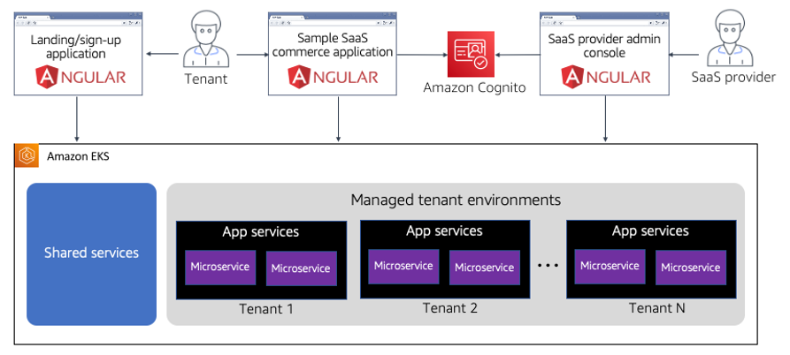
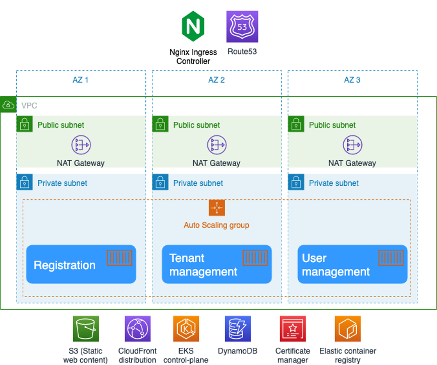
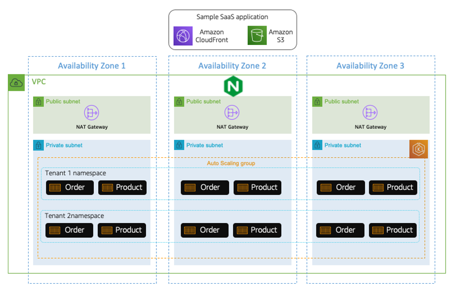
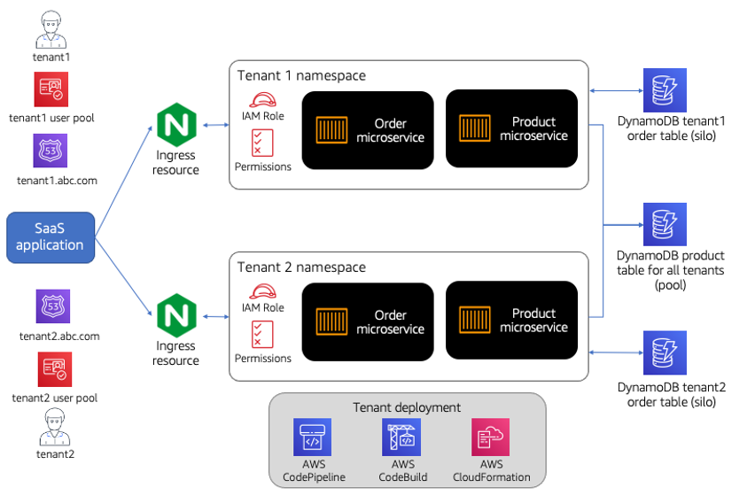
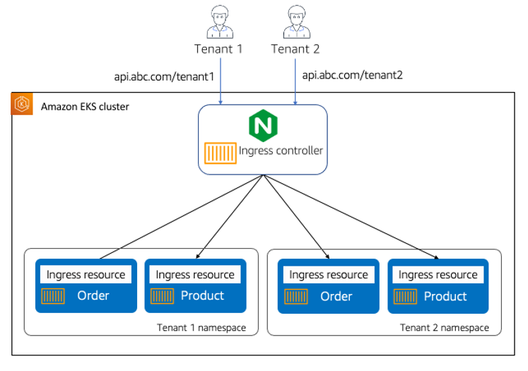
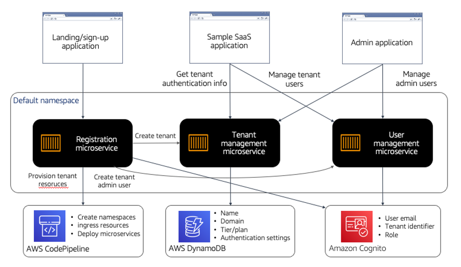
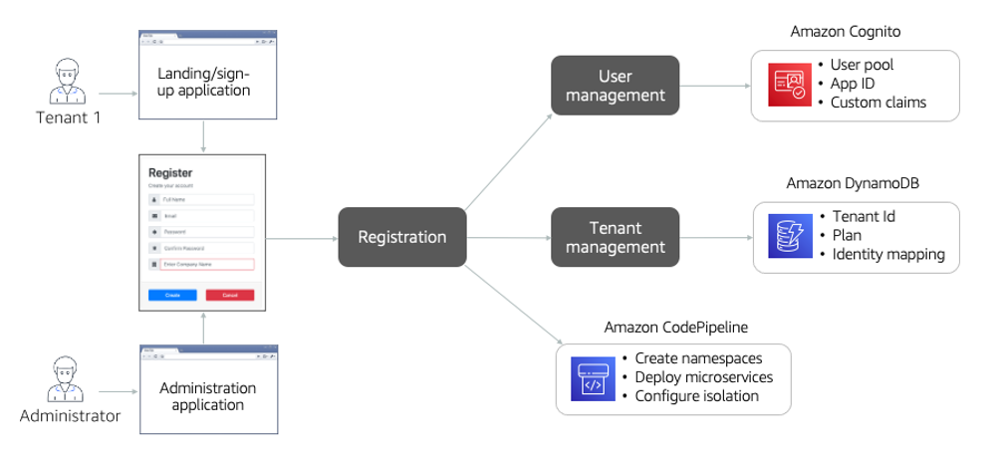
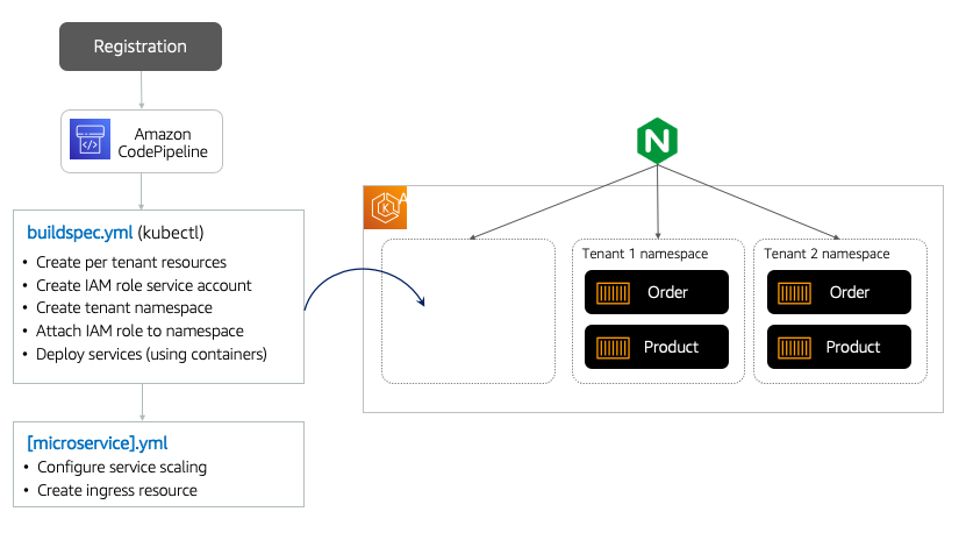
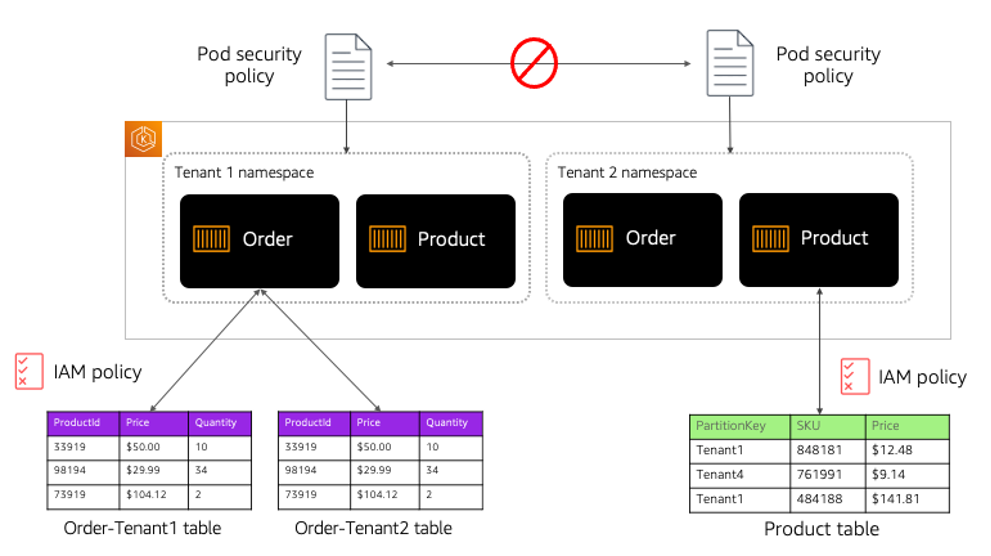
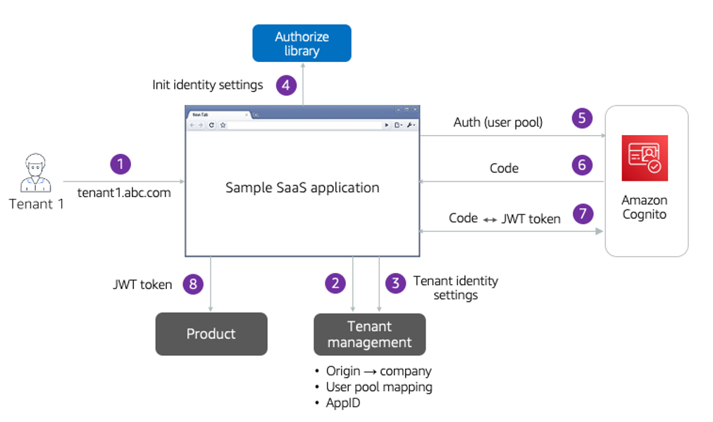

- [Introduction](#introduction)
- [The High-Level Architecture](#the-high-level-architecture)
- [The Baseline Infrastructure](#the-baseline-infrastructure)
  - [EKS Cluster](#eks-cluster)
  - [Kubernetes Objects](#kubernetes-objects)
  - [Amazon CloudFront Distributions](#amazon-cloudfront-distributions)
  - [AWS Certificate Manager (ACM) Certificate](#aws-certificate-manager-acm-certificate)
  - [CloudFormation (CFN) Custom Resource](#cloudformation-cfn-custom-resource)
  - [DynamoDB Tables](#dynamodb-tables)
  - [ECR Repositories](#ecr-repositories)
  - [Route 53 Recordset](#route-53-recordset)
  - [Shared Services Microservices](#shared-services-microservices)
- [Per-tenant Infrastructure](#per-tenant-infrastructure)
  - [Tenant Deployment (Code*)](#tenant-deployment-code)
  - [Route53/CloudFront Aliases](#route53cloudfront-aliases)
  - [Cognito Resources](#cognito-resources)
  - [Product Microservice](#product-microservice)
  - [Order Microservice](#order-microservice)
  - [DynamoDB Storage for Microservices](#dynamodb-storage-for-microservices)
- [Tenant Routing](#tenant-routing)
- [Web Applications](#web-applications)
  - [Admin App](#admin-app)
  - [Sample SaaS Appliction](#sample-saas-appliction)
  - [Landing Page](#landing-page)
- [Shared Services](#shared-services)
  - [Registration Microservice](#registration-microservice)
  - [Tenant Management Microservice](#tenant-management-microservice)
  - [User Management Microservice](#user-management-microservice)
- [Onboarding](#onboarding)
- [Tenant Isolation](#tenant-isolation)
- [Authentication](#authentication)
- [Conclusion](#conclusion)

## Introduction

As more organizations make the move to a software-as-a-service (SaaS) delivery model, many are finding the Amazon Kubernetes Service (EKS) to be a good fit for their business and technical goals. To support this movement, we have created a sample EKS SaaS solution that provides developers and architects with a more concrete example of the architectural and design best practices that are associated with building a multi-tenant SaaS offering on AWS.

In the sections that follow, we’ll look inside the inner-workings of this sample SaaS EKS environment. We’ll explore the key architectural strategies that are used to address the isolation, identity, data partitioning, routing, deployment, and operational considerations associated with building and delivering a SaaS solution an EKS SaaS solution on AWS. Overall, this should equip you with an end-to-end understanding of the entire solution and how to deploy/operate it.

Our focus here is on using this solution to expose you to the fundamentals of an EKS SaaS architecture. It’s not intended to represent a turnkey solution that can be used in a production scenario. Rather, we hope this solution might be the foundational building blocks on which a production deployment is based.

This document is intended for developers and architects who have experience on AWS, specifically with EKS. A working knowledge of both Kubernetes and Angular is also helpful, but not required.

## The High-Level Architecture

Before we dig into the details of the SaaS EKS solution, let’s look at the high-level elements of the architecture. In Figure 1 you’ll see each of the basic layers of the environment.

First, you’ll see that we have three different flavors of applications that are part of the EKS SaaS experience. These correlate to the common types of applications that you would have in many SaaS environments. The first application, the landing page, represent the public-facing page where customer can find and sign-up for our solution. New customer can hit this site, trigger the registration process, and create a new tenant in the system. In this example, we’ve built out an example that supporting a self-service onboarding model. This may not be a fit for every SaaS environment.

  
Figure1 - High-level EKS SaaS Architecture Concepts

The next application you see here is the sample commerce application. Here we’ve created a simple e-commerce application that provides some basic functionality. It relies on Amazon Cognito to authenticate tenants as the enter the system. This is where you land your multi-tenant SaaS application.

The last application is one that is often overlooked by SaaS providers. Here we have the SaaS provider administration console. This application also uses Cognito to control access. As the SaaS provider, you would use the application to configure and manage your tenant policies and settings.

We’ve included these applications to illustrate some of the architectural considerations that influence how these various application and roles would interact with the back-end of your SaaS architecture. We’ve also used the applications to provide an example of how multi-tenant authentication and authorization can be realized in a multi-tenant environment.

Each of these applications interact with services that are running in an EKS cluster. There are two different categories of services that run in this cluster. The shared services layer represents all the common services that needed to support all the operational, management, identity, onboarding, and configuration capabilities of a SaaS environment.

The other category of services shown here are part of the managed tenant environments. The services running here represent the different deployed tenant environment that are running the microservices of our application. You’ll notice here that we have separate deployments for each tenant of our system. We’ll explore the rationale for that architecture decision below.

## The Baseline Infrastructure

Now that we have a sense of the moving concepts, let’s dig into the underlying architecture and see the actual architecture elements that are created when you install the SaaS EKS solution.

Before we can start to think about tenants and applications, we need to get the baseline version of our environment deployed. This baseline infrastructure is comprised of the actual EKS cluster that hosts our service. It also includes all the required AWS supporting infrastructure such as IAM Roles, CloudFront Distributions and backing S3 buckets.

The entire solution is built and deployed from within a Cloud9 instance in an AWS region of your choosing. Please see the Getting Started portion of the README.md file in the root directory of the repo for the latest deployment directions.

  
Figure 2 - Baseline infrastructure

The diagram in Figure 2 outlines the infrastructure elements that are created after you’ve installed the baseline environment. The following is a breakdown of the key components of this baseline architecture.

### EKS Cluster

The EKS cluster, along with its corresponding VPC, subnets and NAT Gateways, is deployed via the eksctl CLI tool. This CLI streamlines the creation of the various CloudFormation scripts required to deploy a ready-to-use EKS cluster. This cluster runs the shared and the tenant environments of your EKS SaaS solution. In some scenarios, it may make sense to have a separate cluster for your shared services.

While we’ve leveraged common patterns for configuring and deploying the cluster, you’ll want to think about how you might further secure the network and cluster based on the specific needs of your environment. You can find additional best practices guidance on making your cluster product-ready here.

### Kubernetes Objects

During baseline deployment, we also need to configure the Kubernetes objects that needed to support the needs of our SaaS environment. The baseline configuration call uses kubectl to configure and deploy these constructs. This includes the deployment and configuration of an open-source Nginx ingress controller and External DNS.

### Amazon CloudFront Distributions

This solution creates three distinct Amazon CloudFront (i.e., Content Delivery) distributions along with supporting infrastructure (e.g., S3 buckets, bucket policies and origin access identities). Although there’s only a single distribution for the e-commerce SaaS application, each tenant gets routed to this distro by way of a CloudFront and DNS alias.

### AWS Certificate Manager (ACM) Certificate

The baseline stack provisions a wildcard certificate corresponding to the custom domain name provided when deployed. This certificate is used to provide HTTPS connections to all public web entities in this solution, namely the three web applications (described in detail below) as well as the public-facing shared and tenant-specific web services.

### CloudFormation (CFN) Custom Resource

A custom CloudFormation resource is used to deploy our ACM certificate. Currently AWS supports creating public certificates only in the us-east-1 region. This custom resource invokes a lambda function to ensure that, regardless of the location of the calling stack, the CFN Certificate is created only in us-east-1.

### DynamoDB Tables

Two DynamoDB tables are created during the provisioning of the baseline infrastructure. One to hold various metadata that’s associated with the infrastructure that is deployed for this solution. The other table serves as a repository for the tenants that will be provisioned as new tenants are onboarded to the system.

### ECR Repositories

An ECR repository is created for each microservice used in this solution. As part of the initial deployment, the containers which house the microservices are built and pushed to these repos. 

### Route 53 Recordset

Route53 DNS records are initially added for two of the three web applications: The admin site and the landing page, admin.DOMAIN and www.DOMAIN respectively (where DOMAIN is the custom domain configured upon deployment). The sample e-commerce application page doesn’t receive a Route53 alias until the first tenant is deployed.

### Shared Services Microservices

You’ll see that baseline infrastructure also includes the shared services that are needed for the use cases that are implemented by the EKS SaaS solution. Here you’ll see that we have Registration, Tenant Management, and User Management microservice deployed into our cluster. A more complete implementation would add services to support billing, metrics, etc. However, since the focus here is more on the EKS elements of SaaS, we’ve left those services out for now.

## Per-tenant Infrastructure

Once you have your baseline infrastructure created, you can begin to think more about the infrastructure that is needed to support tenants as they are onboarded to your SaaS application. The architecture we’ve selected here uses a namespace per tenant model to implement our isolation which requires separate resources to be deployed for each tenant. We’ll explore this isolation model in more detail below.

  
Figure 3 - Deployed tenant microservices

Figure 3 illustrates how the microservices of our application are deployed into our baseline infrastructure. You’ll notice that we’ve landed these in the same cluster that was used to deploy the shared services of the environment. The key difference here is that none of these microservices and namespaces are created until a tenant actually onboards.

Of course, the constructs needed to bring these microservice to has more moving parts to it. The diagram in Figure 4 provides a much more granular view of the elements of our tenant environments.

  
Figure 4 - Per tenant infrastructure

If we look at the basic flow here, you’ll see that we have the assets that are used by the SaaS application to access each of our tenant namespaces. Separate user pools and domains are used to authenticate and route tenants into our environment. As you move further downstream, you’ll see that the solution uses n NGINX ingress controller to route traffic to our namespaces. There are also tooling that is used to configure and deploy these tenant resources.
The sections that follow provide a more detailed breakdown of the architectural elements that are part of these tenant environments.

### Tenant Deployment (Code*)

AWS CodeBuild and CodePipeline are used as the “machine” that orchestrates the configuration and deployment of the various EKS-specific objects needed for tenant deployment and isolation. The Code* projects are defined as CloudFormation resources with parameters that serve as placeholders for the tenant-specific data. These parameters are captured and recorded by the Tenant Management (Java) Service at onboarding-time.

### Route53/CloudFront Aliases

After each tenant is deployed, a new subdomain is added in both Route53 and CloudFormation. The subdomain is an alias for the CloudFront distribution associated with our sample e-commerce SaaS application.

### Cognito Resources

A new Cognito user pool and application client is added per tenant. The pool is configured with a “custom domain” which allows us to use Cognito’s hosted UI for authentication. The SaaS application is configured with authentication guards that redirect to the hosted UI when it detects a user is not authenticated.
A single Cognito user is created in the pool upon tenant onboarding. Additional tenant users may be created via the e-commerce application.

### Product Microservice

The product microservice handles basic CRUD functionality for our e-commerce web app. A product object contains the product name, and price. Once created, the object becomes available to Order.

### Order Microservice

The order service provides basic CRUD functionality for our e-commerce web app. An order object simply contains the order name as well as a collection of objects representing the individual line items in this order--specifically the id, quantity and price of the products ordered.

### DynamoDB Storage for Microservices

We wanted to show multiple data partitioning examples in the EKS SaaS solution. You’ll see that our order microservice, for example, uses a silo storage partitioning model where each tenant has a separate AWS DynamoDB table. A new order table is created for each new tenant that is added to the system.

The product microservice use a pooled partitioning model where tenant data is co-mingled in the same table and accessed via a partition key that is populated with a tenant identifier.
This order tables are secured with IAM Roles that prevent any cross-tenant access. Access to the product tables is also controlled by IAM Roles. In this case, we’ve used IAM Conditions based on tenant-specific partition keys in the DynamoDB table.

## Tenant Routing

As requests flow from the tenant into each of our microservice, the system must be able to identify the tenant that is associated with each request and route that request to the appropriate tenant namespace. There are multiple ways to address this routing requirement. For the EKS SaaS solution, we relied on the open-source NGINX Ingress controller to route traffic to each namespace.

To make this work, the system must create a new ingress resource for each that is deployed for each of our tenants. These ingress controllers are created during the tenant onboarding experience, enabling the NGINX ingress controller to send traffic to the appropriate, tenant-specific destination.

The diagram in Figure 5 provides a view of the key elements of this experience. Here we have two tenants accessing the microservices of our application. The qualify each request with an identifier (/tenant1, for example) that is passed through to the ingress controller. The controller uses this context to route the data to the appropriate tenant microservice.

  
Figure 5 - Routing tenants to namespaces

You’ll see here that the ingress controller runs within our EKS cluster and targets the order and product microservices. It’s at this point where you may also want to introduce different tiering constructs to limit a tenant’s ability to apply excess load to your microservices.

The Ingress controller is deployed in this script, as part of baseline deployment. Afterwards, each onboarded tenant deploys a tenant-specific ingress resource that defines tenant paths and routing rules for that tenant’s services.

## Web Applications

The EKS SaaS environment includes three separate types of web applications. Each of these applications is written in Angular 9 and deployed to their respective S3 Buckets which serve as origins for their own CloudFront distributions. The administration and sample e-commerce SaaS application employ OAuth and OIDC and leverage and authorization library to support the authorization and authentication flow. The landing page application is completely anonymous, and meant to represent a public-facing marketing and onboarding page.

### Admin App

The administration app is meant to represent the experience that would be used by a SaaS Provider. This application provides the management and operations experience for your environment and its tenants.

The application is secured by its own Cognito user pool that’s created during the baseline infrastructure provisioning, detailed above.

### Sample SaaS Application

The sample SaaS application is basic e-commerce application that is here as a placeholder to illustrate how your application would authenticate users and interact with the application’s microservices. The application is secured by its own Cognito user pool that is created and configured as each new the tenant is onboarded.

To resolve tenant context and authenticate against the appropriate tenant user pool the system must also capture and record attributes as part of the onboarding process. All of the tenant authentication bits are stored by the shared Tenant Management service, which uses a DynamoDB keyed by tenant name. This data is accessed during authentication via the /auth endpoint on the Tenant Registration service.

Upon bootstrapping (that is, before the UI of the application is even rendered in the browser), the application reaches out to this auth endpoint for configuration information. The tenant-specific configuration information that’s returned from this call is then fed to the OAuth/OIDC library for configuration. Remember, each tenant application is just an alias for the single SaaS app that was configured and uploaded as part of the baseline infrastructure. This dynamic configuration step is what allows us to use the same client code to serve all tenants.

Once authenticated, the client app illustrates basic microservice interaction with two services: product and order. The idea here is that each tenant can add some number of products, which then serve as line items in a subsequent tenant order.

### Landing Page

The landing page is a simple, anonymous sign-up page. It’s representative of our public-facing marketing page through which prospective tenants can sign-up. When you select the sign-up option, you will provide data about your new tenant and submit that information to the system’s registration service. This service will then create and configure all of the resources needed to introduce a new tenant into the system.

As part of this onboarding flow, the system will also send a verification email to the address that was provided during sign-up. The information in this email will allow you to access the system with a temporary password.

## Shared Services

In our discussion of the baseline infrastructure, we touched on the different shared services that are provisioned and deployed during the setup of your EKS SaaS solution. This concept of shared services is core to any SaaS application, representing all the services to manage and operate your SaaS tenants.

For this particular solution, we’ve introduced a smaller set of services, acknowledging that a full implementation would include additional services (billing, metrics, analytics, etc.). For now, though, put the basic in place to support onboarding, user management, and tenant management.

  
Figure 6 - Shared services

In Figure 6, you’ll see a high-level view of the shared services and their roles within the EKS SaaS solution as well as the relationship these services have to the application and data that they manage. The sections that follow provide a more detailed breakdown of the each of these shared services.

### Registration Microservice

The registration service is a public internet-facing service. It orchestrates all the moving parts associated with onboarding new tenants. The sign-up form from the landing page application submits new tenant data to the registration service to create a new tenant. It then assumes responsibility for orchestrating all the bits needed to create and configure all the resources for that new tenant.

Before registration can create the user and tenant, it must first create the authentication resources (user pool, AppId, etc.). It will call directly to Amazon Cognito to create these resources. After registration creates these resources, it will call user management to create a user for the tenant. This user will be created in the user pool that was provisioned in the prior step. Registration will then call tenant management to create the tenant, supplying the tenant attributes along with the authentication resources (user pool, AppId).

The registration service is also responsible for launching the process that creates the tenant namespaces and deploys the microservices for each tenant. This is represented here by the line to the AWS CodePipeline.

### Tenant Management Microservice

Tenant Management is responsible for manage any policies and configuration associated with a given tenant. It is important to note that tenants are intentionally managed separate from the users for that tenant. In fact, the users and their attributes can be changing without any impact on the tenant configuration.

The data for tenant management is stored in a DynamoDB table. It holds basic information that was supplied the tenant during onboarding (name, plan, etc.). It also holds data that’s part of the authentication configuration for this tenant (user pool, AppId, etc).

Beyond onboarding, the tenant management also exposes basic management APIs that are consumed by the administration application to update the settings for tenants.

### User Management Microservice

The user management service is used in two separate contexts: one for the SaaS application users and one for the administration application. The sample SaaS actually includes a tenant administration experience that illustrates the natural mechanism that you’d include in your SaaS product to manage your application’s users.

User management plays a more specific role during the onboarding of a new tenant. When a new tenant is created, user management will actually create the Cognito user pool and AppId for that tenant (this is a one-time operation for the tenant). This data is then updated in tenant management and used to support the authentication flow.

The administration application uses a separate user pool for administration users. A SaaS provider can use this application to add, update, and delete administration users.

## Onboarding

Onboarding is an essential part of any SaaS solution. With EKS SaaS, we wanted to illustrate how you can build out a process that delivers a completely frictionless onboarding experience that automates the configuration and deployment of the resources that are needed for each new tenant.

For this solution, we have a number of moving parts that are included in the onboarding process. We must create a new tenant, and new user for that tenant, configure the Kubernetes namespace for the tenant, and deploy the application microservices for that tenants. At the end of the process, all of the infrastructure and multi-tenant policies will be in place for your tenants.

Figure 7 outlines the onboarding flow. The process starts with the filling out a sign-up form in the landing page application. This simulates the typical page you would offer as the public-facing experience for new tenants. You’ll also see that onboarding can be triggered by the administration application. We included this flow to allow you to illustrate what it would look like to have this same onboarding experience managed by an internal process. The key takeaway here is that both of these processes rely on the same underlying mechanism to onboard a tenant to the system.

  
Figure 7 - Tenant onboarding

You’ll see there that all onboarding starts with and is orchestrated by the registration service. It assumes responsibility for coordinating and ensuring that all the elements of the onboarding process are successfully created and configured.

The step in this process is to create a new user for the tenant via the user management service, which creates an Amazon Cognito user pool for the tenant. As part of creating a new user, the custom claims are populated with data about the tenant to help correlated users to their corresponding tenants to create a SaaS identity.

Once the user is created, a tenant is then created via the tenant management service. This service captures and stores the fundamental attributes of a tenant along with data from the creation of the user that’s essential to the authentication flow (user pool, AppId, etc.).

After the basics of the tenant and user are created, we can then create and configure the services of the SaaS application. Here we’ve used AWS CodePipeline and AWS CodeBuild to orchestrate the application configuration deployment. This process creates a namespace for each tenant, fetches the container images for the product and order microservices from ECR, and deploys these microservices in to each tenant’s namespace.

In this scenario, we’ve used traditional Kubernetes mechanisms in combination with AWS deployment constructs to automate the setup of these services. The diagram in Figure 8 provides a high-level view of the key elements that are part of this experience.

   
Figure 8 - Provisioning tenant microservices

On the right side of this you’ll see the EKS cluster running our product and order microservices for each tenant. Here we have an NGINX ingress controller sending traffic to each of these namespaces. The left side is where we see the tooling and resources that support the onboarding. The CodePipeline will drive this process. It first uses a buildspec.yml file that will execute commands with kubectl to configure the tenant resources.

A separate file ([microservice].yml) is shown here that represent the file that is used to apply configuration settings that are specific to a given microservice. In this case, it configures the scaling profile and ingress resources for each microservice.

## Tenant Isolation

As described earlier, namespaces are used here to create a logical isolation boundary for the different tenants and their resources in an Amazon EKS cluster. In this reference solution, we are using a namespace-per-tenant model and use it as a way to divide an EKS cluster’s resources across different tenants as part of the overall tenant isolation model. Once a namespace is created for a tenant, an IAM Role for Service Account is created and associated with the namespace, to further implement isolation strategies to secure the tenant’s application and workloads.

But, namespaces have no intrinsic network boundaries by default, and as a result integrating network policy solutions such as Tigera Calico enable you to achieve network isolation by applying fine-grained network policies at the namespace level. In addition to network isolation at a tenant-specific level, you can also harden the security of your multi-tenant Kubernetes cluster by integrating network policies to mitigate Pods from accessing the private IP addresses of Kubernetes nodes, to enhance your container escape mitigation strategy.

As part of our overall tenant isolation story, we must also look at isolation is enforced as these tenant microservices attempt to access other resources. In the EKS SaaS solution we have illustrated how isolation is applied as our microservices are accessing data.

In this solution, we have shown two separate models for representing and isolating tenant data in DynamoDB. Our order microservice uses a siloed data partitioning model with a different table per tenant. The product table uses a pooled model for storage where tenant data is stored in a single table. This model is shown in Figure 9.
  
Figure 9 - Isolating access to resources

Here you’ll see two different level of isolation. At the top of the diagram, you’ll see how we’ve attached pod security policies. You’ll see that each namespace has Service account which in turn is linked to an IAM role. This IAM role has explicit permissions defined that will limit the service account to have access to specific AWS resources. Doing so, introduces credential isolation such that a container can only retrieve credentials for the IAM role that is associated with the service account to which it belongs, which means a container never has access to credentials that are intended for another container that belongs to another pod, or in our case another tenant.

We also have IAM policies that are used to control access to the DynamoDB tables. For orders, these policies ensure that one tenant can’t access another tenant’s table. For products, we have more granular IAM policies that ensure that one tenant can’t access the other items of another tenant.

## Authentication

The authentication experience for the EKS SaaS solution implements an OAuth flow with Amazon Cognito. A key choice we’ve made here is to use a user pool per tenant model. This choice did add some additional complexity to authentication flow since the solution must be able to map a tenant to a specific user pool as part of the authentication process.

Figure 10 provide a high-level overview of the key elements of this onboarding flow. The basic flow starts with a tenant accessing the application via their subdomain (tenant1.abc.com). The system will then go out to the tenant management service to get the data needed to get the authorization info (user pool, AppId, etc.) using the origin of tenant’s subdomain (step 2). This will return the authentication attributes back to the application (step 3).
  
Figure 10 - Authentication flow

The authorization data is recorded in an authorize library that holds this authentication data and makes it easier for the process to reference these attributes (step 4). Now that you have this additional data, the application can authenticate the user against the user pool (step 5). This will return a code (step 6) and exchange that code for a JWT token (step 7). 
At this point, the user is authenticated and we can now use the token from this process to call the microservices of the SaaS application. In this example, we show a call to the product microservice that accepts the JWT token (step 8).

## Conclusion
This document explored the core elements of the Amazon EKS SaaS solution solution by providing a summary of the building blocks used in the overall experience. It should give you a better sense of how the application is built and allow you to more easily navigate the resources in the repository.

We encourage you to dig into the code and provide feedback to help us shape the evolution of this environment. We expect to continue to make enhancements to the solution and address new strategies as they emerge.

